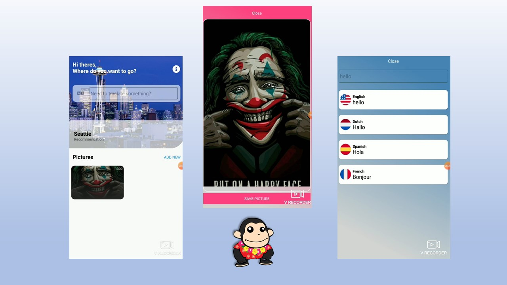

# MonkeyChallenger
Challenge xamarin forms
## Collaborators
-  [Rafael Fernandez](https://github.com/RafaelFernandez0512).
# Platforms
| iOS / Android| Xamarin.Forms |

  

  
  # Features
* [Xamarin.Forms](https://github.com/xamarin/Xamarin.Forms) by Microsoft
* [Prism.Unity.Forms]
* [PancakeView](https://github.com/sthewissen/Xamarin.Forms.PancakeView) by [Steven Thewissen](https://thewissen.io)
* [Xamarin.Essentials](https://github.com/xamarin/Essentials) by Microsoft
* [MediaPlugin](https://github.com/jamesmontemagno/MediaPlugin) by [James Montemagno](https://montemagno.com)
* [Microsoft.Azure.CognitiveServices.Search.ImageSearch](https://github.com/Azure/azure-sdk-for-net) by Microsoft
* [Microsoft.Azure.CognitiveServices.Vision.ComputerVision](https://github.com/Azure/azure-sdk-for-net) by Microsoft
